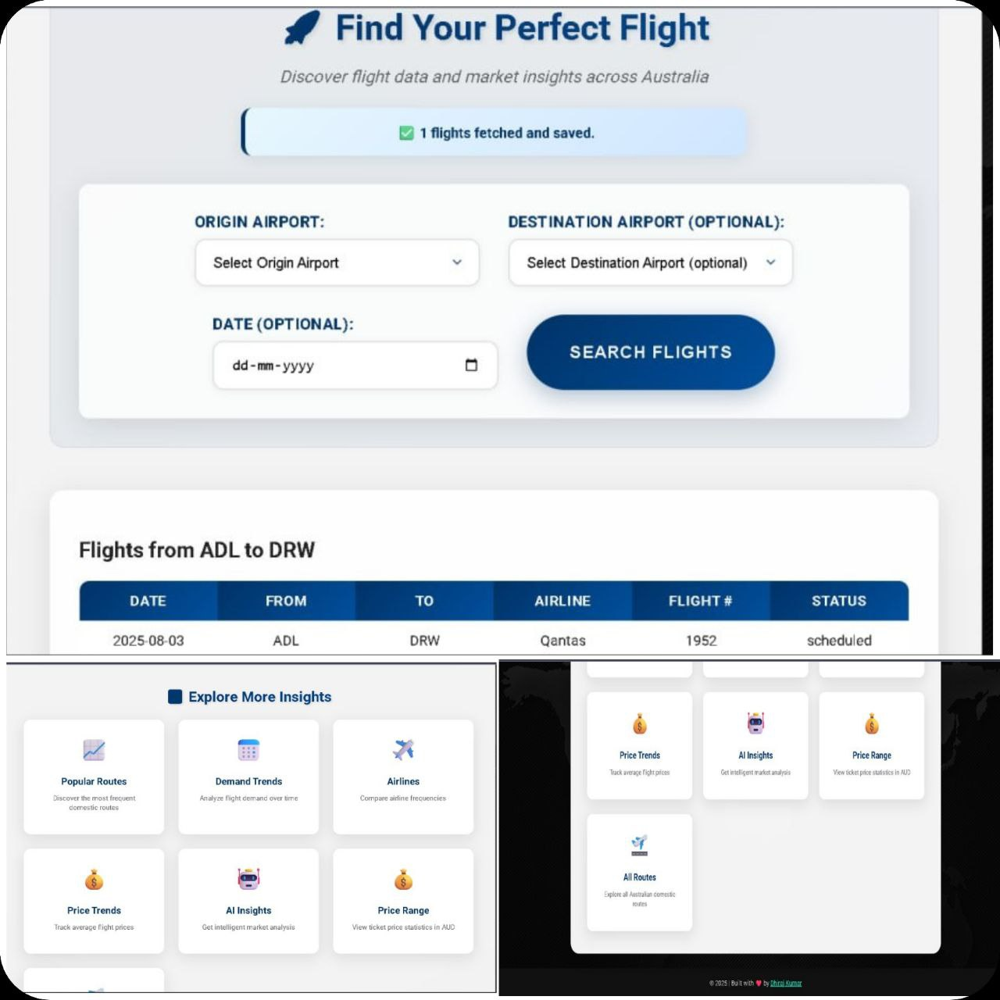
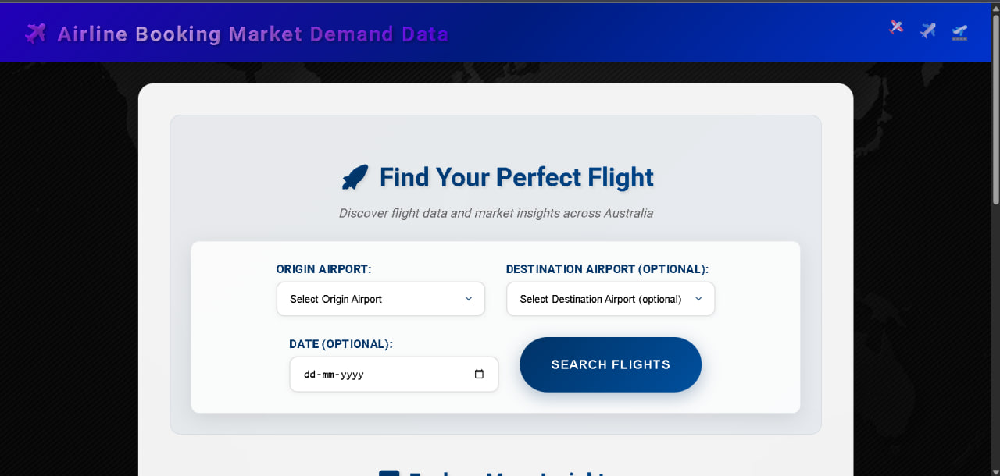
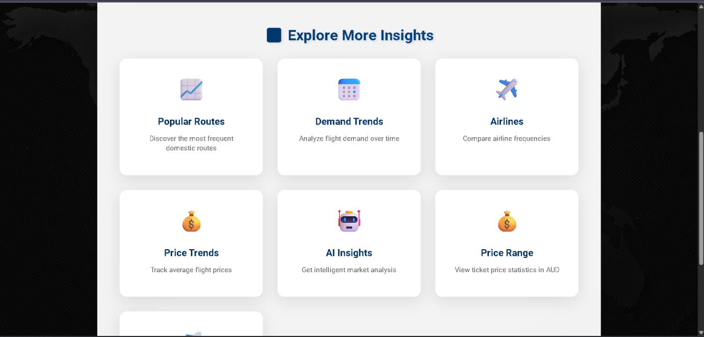
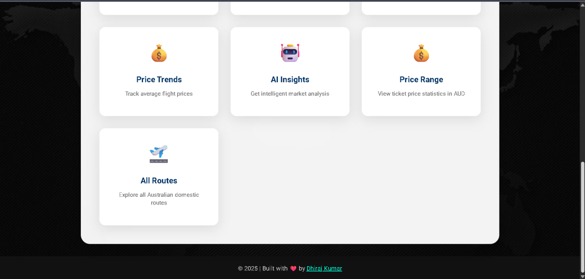
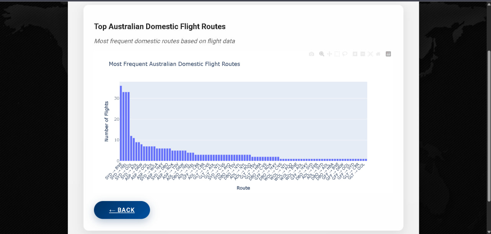
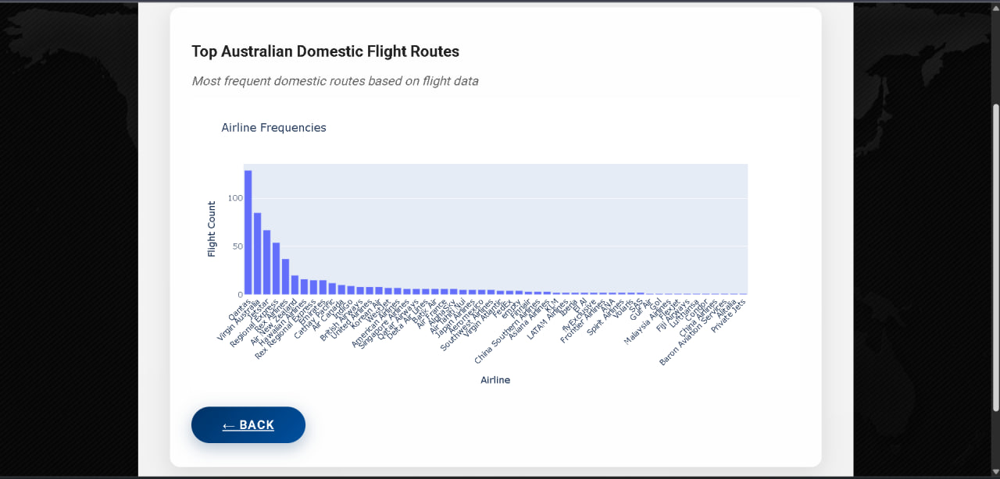

<h1 align="center">✈️ Airline Booking Demand Forecast App</h1>

<p align="center">
  
</p>

<p align="center">
  <b>A complete data-driven web app to forecast airline booking trends with AI-powered insights, live APIs & stunning charts.</b>
</p>

---

## 🚀 Live Demo

🔗 [Coming Soon – Deployed App](#)

---

## 📸 Screenshots Gallery

| Homepage | Flight Chart | Gemini Insights |
|---------|--------------|-----------------|
|  |  |  |
|  |  |  |

🖼️ Remaining: 7.png → 18.png stored in `/images/` folder.

---

## 🧠 Features

- 🔍 **Search & Explore**: Select origin and get real-time data
- 📊 **Plotly Charts**: Price range, daily trends, demand spikes
- 🤖 **AI Analysis**: Google Gemini generates intelligent summaries
- 🌐 **API Integration**: Live data from Skyscanner & AviationStack
- 🧮 **Fallback Mode**: Mock flight generator for offline testing
- 📦 **Modular Design**: Clean code with utils, templates & APIs

---

## ⚙️ Tech Stack

| Layer       | Tech Used                                                                 |
|-------------|---------------------------------------------------------------------------|
| Frontend    | HTML5, CSS3, Bootstrap, Plotly                                            |
| Backend     | Python 3, Flask                                                           |
| APIs        | ✈️ Skyscanner API, 🛫 AviationStack API                                    |
| AI          | Google Gemini Flash-1.5 (narwhals lib)                                    |
| Data Tools  | Pandas, NumPy, Requests, Python-DateUtil                                  |
| Others      | BeautifulSoup (for web scraping), Jinja2, MarkupSafe, OpenAI lib fallback|

---

## 🔧 Setup Instructions

```bash
# 1. Clone the repository
git clone https://github.com/CodeByDhiraj/airline-booking-demand.git
cd airline-booking-demand

# 2. Install dependencies
pip install -r requirements.txt

# 3. Run the Flask app
python app.py


airline-booking-demand/
│
├── app.py                  # Main Flask server
├── requirements.txt        # Python dependencies
├── .gitignore              # Ignored files (db, keys etc.)
│
├── templates/              # HTML Templates (Jinja2)
│   ├── index.html
│   ├── price_trends.html
│   └── ...
│
├── static/                 # CSS & static assets
│   └── style.css
│
├── utils/                  # All helper APIs & logic
│   ├── skyscanner_api.py
│   ├── aviationstack_api.py
│   ├── llama_insight.py
│   └── ...
│
├── data/                   # Local DB for caching
│   └── data.db
│
└── images/                 # Screenshots (1.png to 20.png)


✍️ Author & Credits
👨‍💻 Developed by Dhiraj Kumar

🙏 Acknowledgments
Skyscanner & AviationStack for free flight data APIs

Google Gemini for powerful NLP insights

Plotly & Pandas for beautiful charts

GitHub Copilot & ChatGPT for pairing help

🐱‍💻 GitHub Repo Stats
Star 🌟 this repo if you find it helpful!

# App runs on http://localhost:5000
